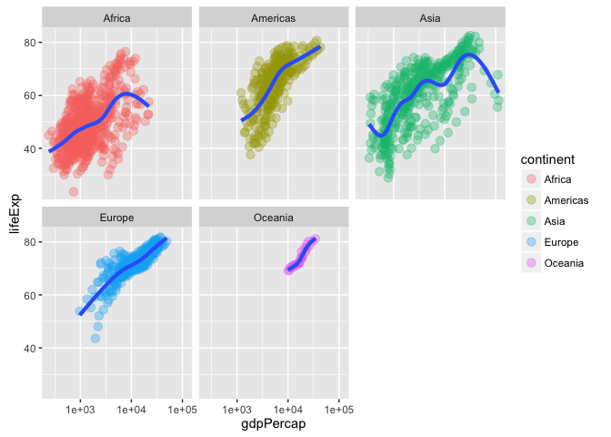

Homework 2
================

``` r
library(gapminder)
library(tidyverse)
```

    ## Loading tidyverse: ggplot2
    ## Loading tidyverse: tibble
    ## Loading tidyverse: tidyr
    ## Loading tidyverse: readr
    ## Loading tidyverse: purrr
    ## Loading tidyverse: dplyr

    ## Conflicts with tidy packages ----------------------------------------------

    ## filter(): dplyr, stats
    ## lag():    dplyr, stats

Smell test the data

Explore the gapminder object:

``` r
str(gapminder)
```

    ## Classes 'tbl_df', 'tbl' and 'data.frame':    1704 obs. of  6 variables:
    ##  $ country  : Factor w/ 142 levels "Afghanistan",..: 1 1 1 1 1 1 1 1 1 1 ...
    ##  $ continent: Factor w/ 5 levels "Africa","Americas",..: 3 3 3 3 3 3 3 3 3 3 ...
    ##  $ year     : int  1952 1957 1962 1967 1972 1977 1982 1987 1992 1997 ...
    ##  $ lifeExp  : num  28.8 30.3 32 34 36.1 ...
    ##  $ pop      : int  8425333 9240934 10267083 11537966 13079460 14880372 12881816 13867957 16317921 22227415 ...
    ##  $ gdpPercap: num  779 821 853 836 740 ...

``` r
summary(gapminder)
```

    ##         country        continent        year         lifeExp     
    ##  Afghanistan:  12   Africa  :624   Min.   :1952   Min.   :23.60  
    ##  Albania    :  12   Americas:300   1st Qu.:1966   1st Qu.:48.20  
    ##  Algeria    :  12   Asia    :396   Median :1980   Median :60.71  
    ##  Angola     :  12   Europe  :360   Mean   :1980   Mean   :59.47  
    ##  Argentina  :  12   Oceania : 24   3rd Qu.:1993   3rd Qu.:70.85  
    ##  Australia  :  12                  Max.   :2007   Max.   :82.60  
    ##  (Other)    :1632                                                
    ##       pop              gdpPercap       
    ##  Min.   :6.001e+04   Min.   :   241.2  
    ##  1st Qu.:2.794e+06   1st Qu.:  1202.1  
    ##  Median :7.024e+06   Median :  3531.8  
    ##  Mean   :2.960e+07   Mean   :  7215.3  
    ##  3rd Qu.:1.959e+07   3rd Qu.:  9325.5  
    ##  Max.   :1.319e+09   Max.   :113523.1  
    ## 

``` r
names(gapminder)
```

    ## [1] "country"   "continent" "year"      "lifeExp"   "pop"       "gdpPercap"

``` r
summary(gapminder$country)
```

    ##              Afghanistan                  Albania                  Algeria 
    ##                       12                       12                       12 
    ##                   Angola                Argentina                Australia 
    ##                       12                       12                       12 
    ##                  Austria                  Bahrain               Bangladesh 
    ##                       12                       12                       12 
    ##                  Belgium                    Benin                  Bolivia 
    ##                       12                       12                       12 
    ##   Bosnia and Herzegovina                 Botswana                   Brazil 
    ##                       12                       12                       12 
    ##                 Bulgaria             Burkina Faso                  Burundi 
    ##                       12                       12                       12 
    ##                 Cambodia                 Cameroon                   Canada 
    ##                       12                       12                       12 
    ## Central African Republic                     Chad                    Chile 
    ##                       12                       12                       12 
    ##                    China                 Colombia                  Comoros 
    ##                       12                       12                       12 
    ##         Congo, Dem. Rep.              Congo, Rep.               Costa Rica 
    ##                       12                       12                       12 
    ##            Cote d'Ivoire                  Croatia                     Cuba 
    ##                       12                       12                       12 
    ##           Czech Republic                  Denmark                 Djibouti 
    ##                       12                       12                       12 
    ##       Dominican Republic                  Ecuador                    Egypt 
    ##                       12                       12                       12 
    ##              El Salvador        Equatorial Guinea                  Eritrea 
    ##                       12                       12                       12 
    ##                 Ethiopia                  Finland                   France 
    ##                       12                       12                       12 
    ##                    Gabon                   Gambia                  Germany 
    ##                       12                       12                       12 
    ##                    Ghana                   Greece                Guatemala 
    ##                       12                       12                       12 
    ##                   Guinea            Guinea-Bissau                    Haiti 
    ##                       12                       12                       12 
    ##                 Honduras         Hong Kong, China                  Hungary 
    ##                       12                       12                       12 
    ##                  Iceland                    India                Indonesia 
    ##                       12                       12                       12 
    ##                     Iran                     Iraq                  Ireland 
    ##                       12                       12                       12 
    ##                   Israel                    Italy                  Jamaica 
    ##                       12                       12                       12 
    ##                    Japan                   Jordan                    Kenya 
    ##                       12                       12                       12 
    ##         Korea, Dem. Rep.              Korea, Rep.                   Kuwait 
    ##                       12                       12                       12 
    ##                  Lebanon                  Lesotho                  Liberia 
    ##                       12                       12                       12 
    ##                    Libya               Madagascar                   Malawi 
    ##                       12                       12                       12 
    ##                 Malaysia                     Mali               Mauritania 
    ##                       12                       12                       12 
    ##                Mauritius                   Mexico                 Mongolia 
    ##                       12                       12                       12 
    ##               Montenegro                  Morocco               Mozambique 
    ##                       12                       12                       12 
    ##                  Myanmar                  Namibia                    Nepal 
    ##                       12                       12                       12 
    ##              Netherlands              New Zealand                Nicaragua 
    ##                       12                       12                       12 
    ##                    Niger                  Nigeria                   Norway 
    ##                       12                       12                       12 
    ##                     Oman                 Pakistan                   Panama 
    ##                       12                       12                       12 
    ##                  (Other) 
    ##                      516

``` r
nrow(gapminder)
```

    ## [1] 1704

``` r
ncol(gapminder)
```

    ## [1] 6

``` r
dim(gapminder)
```

    ## [1] 1704    6

``` r
length(gapminder)
```

    ## [1] 6

Explore individual variables:

``` r
class(gapminder$country)
```

    ## [1] "factor"

``` r
class(gapminder$lifeExp)
```

    ## [1] "numeric"

``` r
max(gapminder$lifeExp)
```

    ## [1] 82.603

``` r
min(gapminder$lifeExp)
```

    ## [1] 23.599

``` r
hist(gapminder$lifeExp)
```


``` r
p <- ggplot(gapminder, aes(x = continent, y = lifeExp)) 
p + geom_point(aes(alpha = 1/5, size = 3))
```


``` r
p + geom_jitter(aes(alpha = 1/5))
```


``` r
p + geom_jitter(position = position_jitter(width = 0.3, height = 0), alpha = 1/5)
```


``` r
table(gapminder$year)
```

    ## 
    ## 1952 1957 1962 1967 1972 1977 1982 1987 1992 1997 2002 2007 
    ##  142  142  142  142  142  142  142  142  142  142  142  142

``` r
table(gapminder$continent)
```

    ## 
    ##   Africa Americas     Asia   Europe  Oceania 
    ##      624      300      396      360       24

``` r
barplot(table(gapminder$continent))
```


``` r
ggplot(gapminder, aes(x = continent)) +
  geom_bar()
```


Explore various plot types:

``` r
plot(lifeExp ~ log(gdpPercap), gapminder)
```


``` r
ggplot(gapminder, aes(x = gdpPercap, y = lifeExp)) +
  scale_x_log10() +
  geom_point(aes(color = continent, alpha = 1/3)) +
  geom_smooth()
```


``` r
p <- ggplot(gapminder, aes(x = year, y = gdpPercap)) 
p +
  geom_jitter(position = position_jitter(width = 0.5, height = 0), alpha = 1/5, aes(color = continent)) +
  geom_smooth(aes(color = continent))
```


``` r
p +
  scale_y_log10() +
  geom_point(alpha = 1/3) +
  facet_wrap( ~ continent) +
  geom_smooth(aes(color = continent))
```


``` r
p <- ggplot(gapminder, aes(x = gdpPercap, y = lifeExp))
p <- p +scale_x_log10()
p + geom_point(aes(color = continent))
```


``` r
p + geom_point(aes(color = continent), alpha = 1/3, size = 3) + facet_wrap(~continent) + geom_smooth(lwd = 1.5, se = FALSE)
```



``` r
## Density plot
p <- ggplot(gapminder, aes(x = gdpPercap, fill = continent)) + scale_x_log10()
p +
  geom_density(alpha = 0.3)
```


``` r
## one quantitative and one categorical variable
p <- ggplot(gapminder, aes(x = continent, y = pop)) + scale_y_log10()
p +
  geom_boxplot(outlier.color = "orange") +
  geom_jitter(position = position_jitter(width = 0.5, height = 0), alpha = 1/5)
```


``` r
france.aus <- gapminder %>% 
  select(year, lifeExp, country, gdpPercap) %>% 
  filter(country == "France" | country == "Australia")

ggplot(france.aus, aes(x = country, y = gdpPercap)) +
  geom_boxplot(outlier.colour = "purple") +
  geom_point(aes(alpha = 1/3, size = 3))
```


``` r
ggplot(france.aus, aes(x = year, y = gdpPercap)) +
  geom_point(aes(color = country, alpha = 1/3, size = 3))
```


