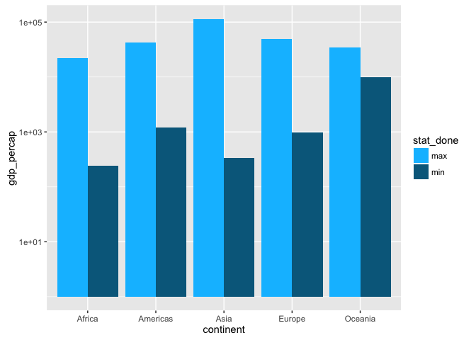
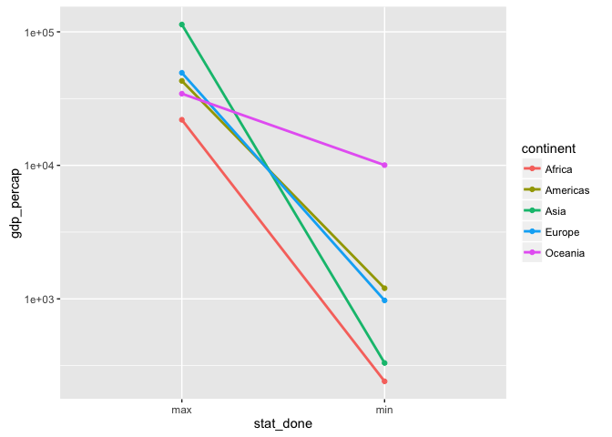
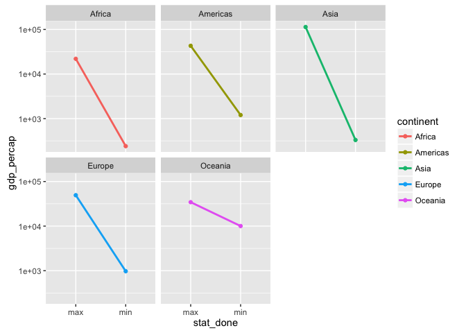
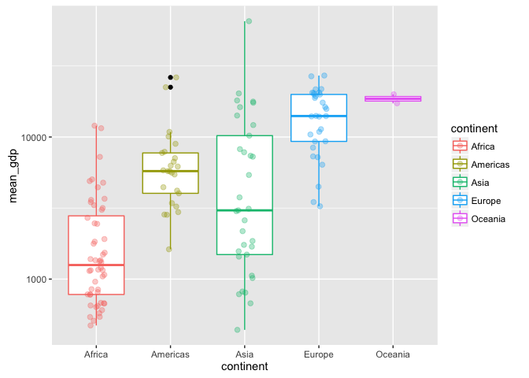
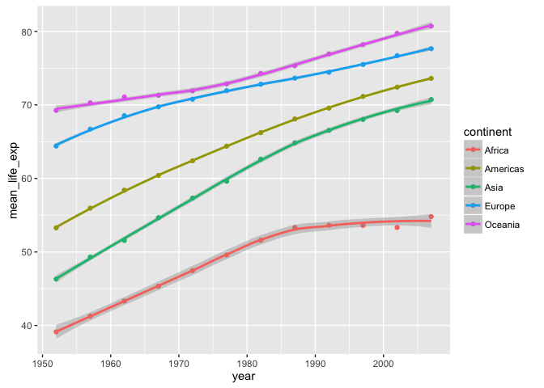
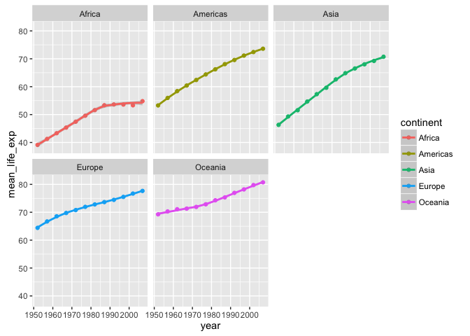

Homework 03: Use dplyr to manipulate and explore data
================
Dre
October 1, 2016

``` r
library(gapminder)
library(tidyverse)
```

    ## Loading tidyverse: ggplot2
    ## Loading tidyverse: tibble
    ## Loading tidyverse: tidyr
    ## Loading tidyverse: readr
    ## Loading tidyverse: purrr
    ## Loading tidyverse: dplyr

    ## Conflicts with tidy packages ----------------------------------------------

    ## filter(): dplyr, stats
    ## lag():    dplyr, stats

``` r
library(RColorBrewer)
```

``` r
summary(gapminder)
```

    ##         country        continent        year         lifeExp     
    ##  Afghanistan:  12   Africa  :624   Min.   :1952   Min.   :23.60  
    ##  Albania    :  12   Americas:300   1st Qu.:1966   1st Qu.:48.20  
    ##  Algeria    :  12   Asia    :396   Median :1980   Median :60.71  
    ##  Angola     :  12   Europe  :360   Mean   :1980   Mean   :59.47  
    ##  Argentina  :  12   Oceania : 24   3rd Qu.:1993   3rd Qu.:70.85  
    ##  Australia  :  12                  Max.   :2007   Max.   :82.60  
    ##  (Other)    :1632                                                
    ##       pop              gdpPercap       
    ##  Min.   :6.001e+04   Min.   :   241.2  
    ##  1st Qu.:2.794e+06   1st Qu.:  1202.1  
    ##  Median :7.024e+06   Median :  3531.8  
    ##  Mean   :2.960e+07   Mean   :  7215.3  
    ##  3rd Qu.:1.959e+07   3rd Qu.:  9325.5  
    ##  Max.   :1.319e+09   Max.   :113523.1  
    ## 

``` r
## str(gapminder)
## glimpse(gapminder)
```

Get the maximum and minimum GDP per capita for each continent

``` r
## remname gapminder data frame
my_data <- gapminder

## Get the maximum and minimum GDP per capita for each continent
## Telling R that you want to group the data by levels of a factor (in this case continent)
## Feed that into the summarize command where you create 2 new variables that provide the max or min of
## gdpPercap within a given group (continent), and then combines the results into a new tibble 
## gdp_per_cap_summary

gdp_percap_summary <- my_data %>% 
  group_by(continent) %>%
  summarize(max_gdp_percap = max(gdpPercap), min_gdp_percap = min(gdpPercap))

knitr::kable(gdp_percap_summary)
```

| continent |  max\_gdp\_percap|  min\_gdp\_percap|
|:----------|-----------------:|-----------------:|
| Africa    |          21951.21|          241.1659|
| Americas  |          42951.65|         1201.6372|
| Asia      |         113523.13|          331.0000|
| Europe    |          49357.19|          973.5332|
| Oceania   |          34435.37|        10039.5956|

``` r
gdp_summary1 <- data.frame(gdp_percap_summary$continent, gdp_percap_summary$max_gdp_percap)
gdp_summary2 <- data.frame(gdp_percap_summary$continent, gdp_percap_summary$min_gdp_percap)
gdp_summary1 <- gdp_summary1 %>% 
  mutate(stat_done = rep(c("max"),nrow(gdp_percap_summary))) %>% 
  rename(continent = gdp_percap_summary.continent,
         gdp_percap = gdp_percap_summary.max_gdp_percap)

gdp_summary2 <- gdp_summary2 %>%
  mutate(stat_done = rep(c("min"),nrow(gdp_percap_summary))) %>% 
  rename(continent = gdp_percap_summary.continent,
         gdp_percap = gdp_percap_summary.min_gdp_percap)

gdp_percap_graph <- rbind(gdp_summary1, gdp_summary2)
gdp_percap_graph$stat_done <- as.factor(gdp_percap_graph$stat_done)

gdp_percap_graph %>% 
  as_tibble()
```

    ## # A tibble: 10 × 3
    ##    continent  gdp_percap stat_done
    ## *     <fctr>       <dbl>    <fctr>
    ## 1     Africa  21951.2118       max
    ## 2   Americas  42951.6531       max
    ## 3       Asia 113523.1329       max
    ## 4     Europe  49357.1902       max
    ## 5    Oceania  34435.3674       max
    ## 6     Africa    241.1659       min
    ## 7   Americas   1201.6372       min
    ## 8       Asia    331.0000       min
    ## 9     Europe    973.5332       min
    ## 10   Oceania  10039.5956       min

``` r
## rearranged tibble so it now looks like this:
knitr::kable(gdp_percap_graph)
```

| continent |  gdp\_percap| stat\_done |
|:----------|------------:|:-----------|
| Africa    |   21951.2118| max        |
| Americas  |   42951.6531| max        |
| Asia      |  113523.1329| max        |
| Europe    |   49357.1902| max        |
| Oceania   |   34435.3674| max        |
| Africa    |     241.1659| min        |
| Americas  |    1201.6372| min        |
| Asia      |     331.0000| min        |
| Europe    |     973.5332| min        |
| Oceania   |   10039.5956| min        |

``` r
f_colors = c("deepskyblue", "deepskyblue4")
names(f_colors) <- levels(gdp_percap_graph$stat_done)

p <- ggplot(gdp_percap_graph, aes(x = continent, y = gdp_percap, fill = stat_done)) + scale_y_log10()
p + geom_bar(stat = "identity", position=position_dodge()) + 
  scale_fill_manual(values = f_colors)
```



``` r
## Looking at the data differently
p <- ggplot(gdp_percap_graph, aes(x = stat_done, y = gdp_percap, group = continent, color = continent)) + scale_y_log10()
p + geom_line(size = 1) + geom_point(aes(color = continent))
```



``` r
p + geom_line(size = 1) + geom_point(aes(color = continent)) +
  facet_wrap(~continent)
```



Look at the spread of GDP per capita for all continents

``` r
gdp_by_continent <- my_data %>% 
  group_by(continent, country) %>% 
  summarise(mean_gdp = mean(gdpPercap), sd_gdp = sd(gdpPercap))

knitr::kable(gdp_by_continent)
```

| continent | country                  |   mean\_gdp|      sd\_gdp|
|:----------|:-------------------------|-----------:|------------:|
| Africa    | Algeria                  |   4426.0260|   1310.33766|
| Africa    | Angola                   |   3607.1005|   1165.90025|
| Africa    | Benin                    |   1155.3951|    159.74131|
| Africa    | Botswana                 |   5031.5036|   4178.13699|
| Africa    | Burkina Faso             |    843.9907|    183.43009|
| Africa    | Burundi                  |    471.6630|     99.32972|
| Africa    | Cameroon                 |   1774.6342|    419.58990|
| Africa    | Central African Republic |    958.7847|    191.95289|
| Africa    | Chad                     |   1165.4537|    230.54808|
| Africa    | Comoros                  |   1314.3803|    298.33439|
| Africa    | Congo, Dem. Rep.         |    648.3426|    257.99344|
| Africa    | Congo, Rep.              |   3312.7882|    822.38327|
| Africa    | Cote d'Ivoire            |   1912.8254|    416.37605|
| Africa    | Djibouti                 |   2697.8332|    538.75314|
| Africa    | Egypt                    |   3074.0307|   1404.75354|
| Africa    | Equatorial Guinea        |   2469.1667|   3665.24975|
| Africa    | Eritrea                  |    541.0025|    170.03515|
| Africa    | Ethiopia                 |    509.1152|     96.42763|
| Africa    | Gabon                    |  11529.8655|   4905.05971|
| Africa    | Gambia                   |    680.1326|    119.05832|
| Africa    | Ghana                    |   1044.5820|    145.82882|
| Africa    | Guinea                   |    776.0673|    137.21068|
| Africa    | Guinea-Bissau            |    652.1572|    169.76009|
| Africa    | Kenya                    |   1200.4157|    207.54399|
| Africa    | Lesotho                  |    780.5534|    404.23293|
| Africa    | Liberia                  |    604.8141|     98.98833|
| Africa    | Libya                    |  12013.5792|   6508.82914|
| Africa    | Madagascar               |   1335.5950|    300.79757|
| Africa    | Malawi                   |    575.4472|    122.99995|
| Africa    | Mali                     |    673.0931|    184.29816|
| Africa    | Mauritania               |   1356.6710|    314.65114|
| Africa    | Mauritius                |   4768.9422|   2981.78351|
| Africa    | Morocco                  |   2447.9089|    741.96456|
| Africa    | Mozambique               |    542.2783|    128.87542|
| Africa    | Namibia                  |   3675.5821|    658.47242|
| Africa    | Niger                    |    781.0768|    171.54888|
| Africa    | Nigeria                  |   1488.3094|    342.76171|
| Africa    | Reunion                  |   4898.3984|   1543.32546|
| Africa    | Rwanda                   |    675.6690|    142.22991|
| Africa    | Sao Tome and Principe    |   1382.7820|    315.91577|
| Africa    | Senegal                  |   1533.1217|    105.39935|
| Africa    | Sierra Leone             |   1072.8195|    278.16372|
| Africa    | Somalia                  |   1140.7933|    191.27798|
| Africa    | South Africa             |   7247.4311|   1313.59794|
| Africa    | Sudan                    |   1835.0104|    321.75329|
| Africa    | Swaziland                |   3163.3524|   1159.95760|
| Africa    | Tanzania                 |    849.2813|    116.00367|
| Africa    | Togo                     |   1153.8201|    280.83257|
| Africa    | Tunisia                  |   3477.2104|   1799.83703|
| Africa    | Uganda                   |    810.3838|    133.10090|
| Africa    | Zambia                   |   1358.1994|    247.49498|
| Africa    | Zimbabwe                 |    635.8580|    133.68921|
| Americas  | Argentina                |   8955.5538|   1862.58315|
| Americas  | Bolivia                  |   2961.2288|    524.74871|
| Americas  | Brazil                   |   5829.3167|   2436.45375|
| Americas  | Canada                   |  22410.7463|   8210.11279|
| Americas  | Chile                    |   6703.2891|   3026.19402|
| Americas  | Colombia                 |   4195.3429|   1652.93147|
| Americas  | Costa Rica               |   5448.6108|   2018.53290|
| Americas  | Cuba                     |   6283.2587|   1127.78107|
| Americas  | Dominican Republic       |   2844.8564|   1373.90623|
| Americas  | Ecuador                  |   5733.6248|   1435.15228|
| Americas  | El Salvador              |   4431.8466|    804.70070|
| Americas  | Guatemala                |   4015.4028|    992.21577|
| Americas  | Haiti                    |   1620.7393|    266.44930|
| Americas  | Honduras                 |   2834.4131|    453.58591|
| Americas  | Jamaica                  |   6197.6454|   1343.47237|
| Americas  | Mexico                   |   7724.1127|   2770.81225|
| Americas  | Nicaragua                |   3424.6558|   1044.60217|
| Americas  | Panama                   |   5754.8272|   2139.35072|
| Americas  | Paraguay                 |   3239.6068|    971.54303|
| Americas  | Peru                     |   5613.8441|   1056.66012|
| Americas  | Puerto Rico              |  10863.1643|   5652.97815|
| Americas  | Trinidad and Tobago      |   7866.8719|   3944.47309|
| Americas  | United States            |  26261.1513|   9695.05810|
| Americas  | Uruguay                  |   7100.1332|   1612.25926|
| Americas  | Venezuela                |  10088.5163|   1476.39086|
| Asia      | Afghanistan              |    802.6746|    108.20293|
| Asia      | Bahrain                  |  18077.6639|   5415.41336|
| Asia      | Bangladesh               |    817.5588|    235.07965|
| Asia      | Cambodia                 |    675.3678|    360.25487|
| Asia      | China                    |   1488.3077|   1370.62833|
| Asia      | Hong Kong, China         |  16228.7009|  12207.32973|
| Asia      | India                    |   1057.2963|    570.24822|
| Asia      | Indonesia                |   1741.3654|    996.51087|
| Asia      | Iran                     |   7376.5829|   2954.18391|
| Asia      | Iraq                     |   7811.8091|   4150.26630|
| Asia      | Israel                   |  14160.9364|   6901.74873|
| Asia      | Japan                    |  17750.8700|  10131.61254|
| Asia      | Jordan                   |   3128.1208|   1023.91618|
| Asia      | Korea, Dem. Rep.         |   2591.8526|   1226.50614|
| Asia      | Korea, Rep.              |   8217.3185|   7699.80364|
| Asia      | Kuwait                   |  65332.9105|  33882.13954|
| Asia      | Lebanon                  |   7269.2162|   1751.50824|
| Asia      | Malaysia                 |   5406.0382|   3749.83723|
| Asia      | Mongolia                 |   1692.8046|    664.74783|
| Asia      | Myanmar                  |    439.3333|    175.40153|
| Asia      | Nepal                    |    782.7288|    185.40100|
| Asia      | Oman                     |  12138.5622|   7651.50112|
| Asia      | Pakistan                 |   1439.2707|    634.98491|
| Asia      | Philippines              |   2174.7711|    545.22796|
| Asia      | Saudi Arabia             |  20261.7436|   8754.38744|
| Asia      | Singapore                |  17425.3823|  14926.14777|
| Asia      | Sri Lanka                |   1854.7311|    934.68975|
| Asia      | Syria                    |   3009.2880|    908.22017|
| Asia      | Taiwan                   |  10224.8072|   9482.60828|
| Asia      | Thailand                 |   3045.9665|   2325.90003|
| Asia      | Vietnam                  |   1017.7126|    567.48225|
| Asia      | West Bank and Gaza       |   3759.9968|   1716.84061|
| Asia      | Yemen, Rep.              |   1569.2747|    609.93916|
| Europe    | Albania                  |   3255.3666|   1192.35151|
| Europe    | Austria                  |  20411.9163|   9655.28149|
| Europe    | Belgium                  |  19900.7581|   8391.18627|
| Europe    | Bosnia and Herzegovina   |   3484.7791|   1950.52235|
| Europe    | Bulgaria                 |   6384.0552|   2351.96362|
| Europe    | Croatia                  |   9331.7123|   3784.40866|
| Europe    | Czech Republic           |  13920.0114|   4361.64675|
| Europe    | Denmark                  |  21671.8249|   8305.07787|
| Europe    | Finland                  |  17473.7227|   8360.17067|
| Europe    | France                   |  18833.5703|   7903.23423|
| Europe    | Germany                  |  20556.6844|   8076.26191|
| Europe    | Greece                   |  13969.0368|   7289.92885|
| Europe    | Hungary                  |  10888.1757|   3620.18198|
| Europe    | Iceland                  |  20531.4223|   9373.24589|
| Europe    | Ireland                  |  15758.6062|  11573.31102|
| Europe    | Italy                    |  16245.2090|   8273.52317|
| Europe    | Montenegro               |   7208.0646|   2848.95520|
| Europe    | Netherlands              |  21748.8522|   8918.86641|
| Europe    | Norway                   |  26747.3066|  13421.94725|
| Europe    | Poland                   |   8416.5539|   3198.35120|
| Europe    | Portugal                 |  11354.0919|   6222.54489|
| Europe    | Romania                  |   7300.1700|   2425.97354|
| Europe    | Serbia                   |   9305.0494|   3829.90684|
| Europe    | Slovak Republic          |  10415.5307|   3650.23083|
| Europe    | Slovenia                 |  14074.5821|   6470.28821|
| Europe    | Spain                    |  14029.8265|   8046.63457|
| Europe    | Sweden                   |  19943.1261|   7723.24784|
| Europe    | Switzerland              |  27074.3344|   6886.46331|
| Europe    | Turkey                   |   4469.4534|   2049.66510|
| Europe    | United Kingdom           |  19380.4730|   7388.18940|
| Oceania   | Australia                |  19980.5956|   7815.40522|
| Oceania   | New Zealand              |  17262.6228|   4409.00917|

``` r
ggplot(gdp_by_continent, aes(x = continent, y = mean_gdp, color = continent)) + scale_y_log10() +
  geom_boxplot(outlier.colour = "black") +
  geom_jitter(position = position_jitter(width = 0.3, height = 0), alpha = 1/3, size = 2)
```



``` r
gdp_spread_continent <- my_data %>% 
  group_by(continent) %>% 
  summarise(mean_gdp = mean(gdpPercap), sd_gdp = sd(gdpPercap), max_gdp = max(gdpPercap), min_gdp = min(gdpPercap))

knitr::kable(gdp_spread_continent)
```

| continent |  mean\_gdp|    sd\_gdp|   max\_gdp|    min\_gdp|
|:----------|----------:|----------:|----------:|-----------:|
| Africa    |   2193.755|   2827.930|   21951.21|    241.1659|
| Americas  |   7136.110|   6396.764|   42951.65|   1201.6372|
| Asia      |   7902.150|  14045.373|  113523.13|    331.0000|
| Europe    |  14469.476|   9355.213|   49357.19|    973.5332|
| Oceania   |  18621.609|   6358.983|   34435.37|  10039.5956|

How is life expectancy changing over time on different continents?

``` r
life_exp_by_continent <- my_data %>% 
  group_by(continent, year) %>% 
  summarize(mean_life_exp = mean(lifeExp))
  
knitr::kable(life_exp_by_continent)
```

| continent |  year|  mean\_life\_exp|
|:----------|-----:|----------------:|
| Africa    |  1952|         39.13550|
| Africa    |  1957|         41.26635|
| Africa    |  1962|         43.31944|
| Africa    |  1967|         45.33454|
| Africa    |  1972|         47.45094|
| Africa    |  1977|         49.58042|
| Africa    |  1982|         51.59287|
| Africa    |  1987|         53.34479|
| Africa    |  1992|         53.62958|
| Africa    |  1997|         53.59827|
| Africa    |  2002|         53.32523|
| Africa    |  2007|         54.80604|
| Americas  |  1952|         53.27984|
| Americas  |  1957|         55.96028|
| Americas  |  1962|         58.39876|
| Americas  |  1967|         60.41092|
| Americas  |  1972|         62.39492|
| Americas  |  1977|         64.39156|
| Americas  |  1982|         66.22884|
| Americas  |  1987|         68.09072|
| Americas  |  1992|         69.56836|
| Americas  |  1997|         71.15048|
| Americas  |  2002|         72.42204|
| Americas  |  2007|         73.60812|
| Asia      |  1952|         46.31439|
| Asia      |  1957|         49.31854|
| Asia      |  1962|         51.56322|
| Asia      |  1967|         54.66364|
| Asia      |  1972|         57.31927|
| Asia      |  1977|         59.61056|
| Asia      |  1982|         62.61794|
| Asia      |  1987|         64.85118|
| Asia      |  1992|         66.53721|
| Asia      |  1997|         68.02052|
| Asia      |  2002|         69.23388|
| Asia      |  2007|         70.72848|
| Europe    |  1952|         64.40850|
| Europe    |  1957|         66.70307|
| Europe    |  1962|         68.53923|
| Europe    |  1967|         69.73760|
| Europe    |  1972|         70.77503|
| Europe    |  1977|         71.93777|
| Europe    |  1982|         72.80640|
| Europe    |  1987|         73.64217|
| Europe    |  1992|         74.44010|
| Europe    |  1997|         75.50517|
| Europe    |  2002|         76.70060|
| Europe    |  2007|         77.64860|
| Oceania   |  1952|         69.25500|
| Oceania   |  1957|         70.29500|
| Oceania   |  1962|         71.08500|
| Oceania   |  1967|         71.31000|
| Oceania   |  1972|         71.91000|
| Oceania   |  1977|         72.85500|
| Oceania   |  1982|         74.29000|
| Oceania   |  1987|         75.32000|
| Oceania   |  1992|         76.94500|
| Oceania   |  1997|         78.19000|
| Oceania   |  2002|         79.74000|
| Oceania   |  2007|         80.71950|

``` r
p <- ggplot(life_exp_by_continent, aes(x = year, y = mean_life_exp, color = continent)) 
p + geom_point() +
  geom_smooth()
```



``` r
p + geom_point() +
  geom_smooth() + 
  facet_wrap(~continent) 
```



I used a lot of the online material linked to through the course website and the R cheatsheets to help remind me which commands would do what I was trying to achieve. I wish I had more time to make more interesting graphs.
