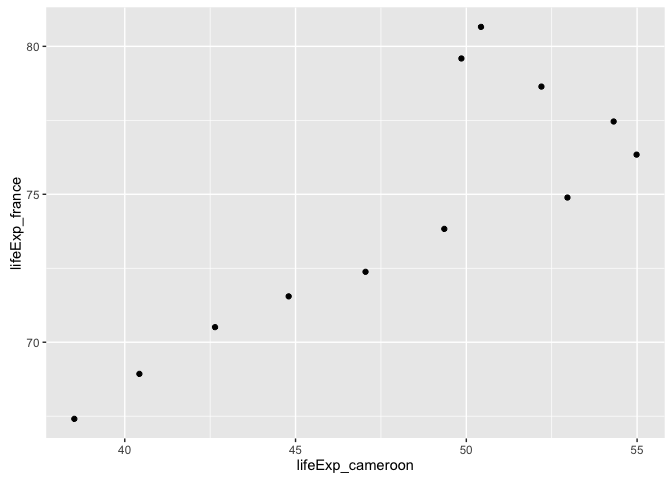
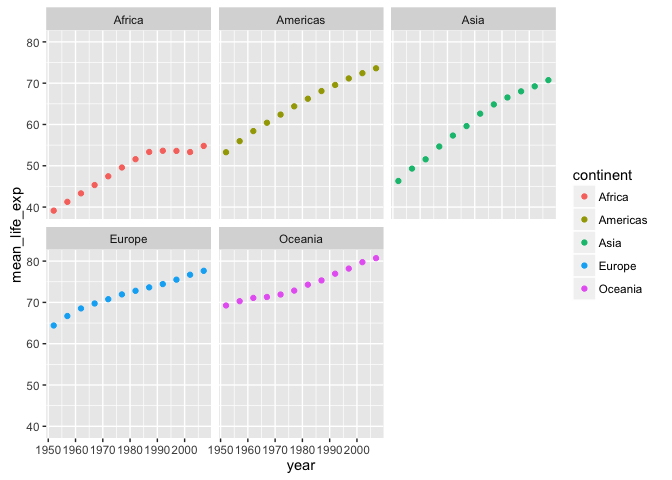

Homework 04
================

``` r
library(tidyverse)
```

    ## Loading tidyverse: ggplot2
    ## Loading tidyverse: tibble
    ## Loading tidyverse: tidyr
    ## Loading tidyverse: readr
    ## Loading tidyverse: purrr
    ## Loading tidyverse: dplyr

    ## Conflicts with tidy packages ----------------------------------------------

    ## filter(): dplyr, stats
    ## lag():    dplyr, stats

``` r
library(gapminder)
```

``` r
str(gapminder)
```

    ## Classes 'tbl_df', 'tbl' and 'data.frame':    1704 obs. of  6 variables:
    ##  $ country  : Factor w/ 142 levels "Afghanistan",..: 1 1 1 1 1 1 1 1 1 1 ...
    ##  $ continent: Factor w/ 5 levels "Africa","Americas",..: 3 3 3 3 3 3 3 3 3 3 ...
    ##  $ year     : int  1952 1957 1962 1967 1972 1977 1982 1987 1992 1997 ...
    ##  $ lifeExp  : num  28.8 30.3 32 34 36.1 ...
    ##  $ pop      : int  8425333 9240934 10267083 11537966 13079460 14880372 12881816 13867957 16317921 22227415 ...
    ##  $ gdpPercap: num  779 821 853 836 740 ...

``` r
my_data <- gapminder


## Need year, country, life expectancy for 2 countries
my_cameroon <- my_data %>% 
  filter(country == 'Cameroon') %>% 
  select(year, lifeExp) %>% 
  rename(lifeExp_cameroon = lifeExp)
  
my_france <- my_data %>% 
  filter(country == 'France')%>% 
  select(year, lifeExp)%>% 
  rename(lifeExp_france = lifeExp)

new_table <- left_join(my_cameroon, my_france, by = "year")

knitr::kable(new_table)
```

|  year|  lifeExp\_cameroon|  lifeExp\_france|
|-----:|------------------:|----------------:|
|  1952|             38.523|           67.410|
|  1957|             40.428|           68.930|
|  1962|             42.643|           70.510|
|  1967|             44.799|           71.550|
|  1972|             47.049|           72.380|
|  1977|             49.355|           73.830|
|  1982|             52.961|           74.890|
|  1987|             54.985|           76.340|
|  1992|             54.314|           77.460|
|  1997|             52.199|           78.640|
|  2002|             49.856|           79.590|
|  2007|             50.430|           80.657|

``` r
p <- ggplot(new_table, aes(x = lifeExp_cameroon, y = lifeExp_france))
p + geom_point()
```



``` r
## do this using spread instead

my_data_spread <- gapminder %>% 
  filter(country == "Cameroon" | country == "France") %>% 
  select(year, country, lifeExp) %>% 
  spread(key = "country", value = "lifeExp")

knitr::kable(my_data_spread)
```

|  year|  Cameroon|  France|
|-----:|---------:|-------:|
|  1952|    38.523|  67.410|
|  1957|    40.428|  68.930|
|  1962|    42.643|  70.510|
|  1967|    44.799|  71.550|
|  1972|    47.049|  72.380|
|  1977|    49.355|  73.830|
|  1982|    52.961|  74.890|
|  1987|    54.985|  76.340|
|  1992|    54.314|  77.460|
|  1997|    52.199|  78.640|
|  2002|    49.856|  79.590|
|  2007|    50.430|  80.657|

``` r
p <- ggplot(my_data_spread, aes(x = Cameroon, y = France, label = year, color = year))
p + geom_point() +
  geom_text(check_overlap = TRUE, nudge_y = 0.5)
```


Activity \#3 Compute mean life expectancy for all combinations of continent and year. Reshape to have one row per year and one variable for each continent.

``` r
my_data2 <- my_data %>% 
  group_by(continent, year) %>% 
  summarise(mean_life_exp = mean(lifeExp))

p2 <- ggplot(my_data2, aes(x = year, y = mean_life_exp))
p2 + geom_point(aes(color = continent)) 
```


``` r
p2 + geom_point(aes(color = continent)) +
  facet_wrap(~continent)
```



``` r
my_data2_table <- my_data2 %>% 
  spread(key = continent, value = mean_life_exp)

knitr::kable(my_data2_table)
```

|  year|    Africa|  Americas|      Asia|    Europe|  Oceania|
|-----:|---------:|---------:|---------:|---------:|--------:|
|  1952|  39.13550|  53.27984|  46.31439|  64.40850|  69.2550|
|  1957|  41.26635|  55.96028|  49.31854|  66.70307|  70.2950|
|  1962|  43.31944|  58.39876|  51.56322|  68.53923|  71.0850|
|  1967|  45.33454|  60.41092|  54.66364|  69.73760|  71.3100|
|  1972|  47.45094|  62.39492|  57.31927|  70.77503|  71.9100|
|  1977|  49.58042|  64.39156|  59.61056|  71.93777|  72.8550|
|  1982|  51.59287|  66.22884|  62.61794|  72.80640|  74.2900|
|  1987|  53.34479|  68.09072|  64.85118|  73.64217|  75.3200|
|  1992|  53.62958|  69.56836|  66.53721|  74.44010|  76.9450|
|  1997|  53.59827|  71.15048|  68.02052|  75.50517|  78.1900|
|  2002|  53.32523|  72.42204|  69.23388|  76.70060|  79.7400|
|  2007|  54.80604|  73.60812|  70.72848|  77.64860|  80.7195|

Join, Merge, Lookup

Activity 2: Make your own cheatsheet

``` r
## Make 3 data frames

imdb <- "
                          movie,      director,              studio,     budget,    genre, country
                     Fight Club, David Fincher,                 Fox,   63000000,     drama,   USA
One Flew Over the Cuckoo's Nest,  Milos Forman,       Fantasy Films,    4400000,     drama,   USA
                  The Searchers,     John Ford,         Warner Bros,    3750000, adventure,   USA
             American History X,     Tony Kaye,     New Line Cinema,    7500000,     crime,   USA
             The Maltese Falcon,   John Huston,         Warner Bros,     375000,   mystery,   USA
                Cinema Paradiso, Giuseppe Tornatore,  Cristaldifilm,    5000000,     drama, Italy
               Django Unchained, Quentin Tarantino,       Weinstein, 100000000,  western,   USA
              Princess Mononoke, Hayao Miyazaki,             DENTSU,   23151960, adventure, Japan
                   Citizen Kane,   Orson Welles, RKO Radio Pictures,     839727,   mystery,   USA
                        Amadeus,  Milos Forman,                AMLF,   18000000,   biography,   USA
          To Kill a Mockingbird, Robert Mulligan, Universal International, 2000000, crime, USA
                           Room, Lenny Abrahamson,  Element Pictures,  13000000,     drama, Ireland
                      True Grit, Coen brothers,   Paramount Pictures,   38000000,   western,   USA
                       Deadpool,    Tim Miller,                  Fox,  58000000,    comedy,   USA
             The Imitation Game, Morten Tyldum,  Black Bear Pictures,  14000000, biography, UK
                   Donnie Darko, Richard Kelly,       Pandora Cinema,   4500000, drama, USA
                The Truman Show, Peter Weir,      Paramount Pictures,  60000000, comedy, USA
                         Ip Man, Wilson Yip,  Beijing ShengShi HuaRei, 11715578, biography, HK
                         Gandhi, Richard Attenborough,  International Film Investors, 22000000, biography, UK
    The Cabinet of Dr. Caligari, Robert Wiene, Decla-Bioscop AG, 18000, fantasy, Germany
               The way way back,  Nat Faxon, Sycamore Pictures, 5000000, comedy, USA
                       Clueless, Amy Heckerling,  Paramount Pictures, 12000000, comedy, USA
"

imdb <- read_csv(imdb, trim_ws = TRUE, skip = 1)

knitr::kable(imdb)
```

| movie                           | director             | studio                       |     budget| genre     | country |
|:--------------------------------|:---------------------|:-----------------------------|----------:|:----------|:--------|
| Fight Club                      | David Fincher        | Fox                          |   63000000| drama     | USA     |
| One Flew Over the Cuckoo's Nest | Milos Forman         | Fantasy Films                |    4400000| drama     | USA     |
| The Searchers                   | John Ford            | Warner Bros                  |    3750000| adventure | USA     |
| American History X              | Tony Kaye            | New Line Cinema              |    7500000| crime     | USA     |
| The Maltese Falcon              | John Huston          | Warner Bros                  |     375000| mystery   | USA     |
| Cinema Paradiso                 | Giuseppe Tornatore   | Cristaldifilm                |    5000000| drama     | Italy   |
| Django Unchained                | Quentin Tarantino    | Weinstein                    |  100000000| western   | USA     |
| Princess Mononoke               | Hayao Miyazaki       | DENTSU                       |   23151960| adventure | Japan   |
| Citizen Kane                    | Orson Welles         | RKO Radio Pictures           |     839727| mystery   | USA     |
| Amadeus                         | Milos Forman         | AMLF                         |   18000000| biography | USA     |
| To Kill a Mockingbird           | Robert Mulligan      | Universal International      |    2000000| crime     | USA     |
| Room                            | Lenny Abrahamson     | Element Pictures             |   13000000| drama     | Ireland |
| True Grit                       | Coen brothers        | Paramount Pictures           |   38000000| western   | USA     |
| Deadpool                        | Tim Miller           | Fox                          |   58000000| comedy    | USA     |
| The Imitation Game              | Morten Tyldum        | Black Bear Pictures          |   14000000| biography | UK      |
| Donnie Darko                    | Richard Kelly        | Pandora Cinema               |    4500000| drama     | USA     |
| The Truman Show                 | Peter Weir           | Paramount Pictures           |   60000000| comedy    | USA     |
| Ip Man                          | Wilson Yip           | Beijing ShengShi HuaRei      |   11715578| biography | HK      |
| Gandhi                          | Richard Attenborough | International Film Investors |   22000000| biography | UK      |
| The Cabinet of Dr. Caligari     | Robert Wiene         | Decla-Bioscop AG             |      18000| fantasy   | Germany |
| The way way back                | Nat Faxon            | Sycamore Pictures            |    5000000| comedy    | USA     |
| Clueless                        | Amy Heckerling       | Paramount Pictures           |   12000000| comedy    | USA     |

``` r
viewed <- "
                          movie,  seen, year_released
                     Fight Club,  TRUE, 1999
One Flew Over the Cuckoo's Nest,  TRUE, 1975
                  The Searchers,  TRUE, 1956
             American History X,  TRUE, 1998
             The Maltese Falcon, FALSE, 1941
                Cinema Paradiso,  TRUE, 1988
               Django Unchained,  TRUE, 2012
              Princess Mononoke,  TRUE, 1997
                   Citizen Kane,  TRUE, 1941
                        Amadeus,  TRUE, 1984
          To Kill a Mockingbird,  TRUE, 1962
                           Room, FALSE, 2015
                      True Grit,  TRUE, 2010
                       Deadpool,  TRUE, 2016
             The Imitation Game,  TRUE, 2014
                   Donnie Darko, FALSE, 2001
                The Truman Show,  TRUE, 1998
                         Ip Man, FALSE, 2008
                         Gandhi, FALSE, 1982
    The Cabinet of Dr. Caligari,  TRUE, 1920
               The way way back,  TRUE, 2013
                       Clueless,  TRUE, 1995
"
viewed <- read_csv(viewed, trim_ws = TRUE, skip = 1)

knitr::kable(viewed)
```

| movie                           | seen  |  year\_released|
|:--------------------------------|:------|---------------:|
| Fight Club                      | TRUE  |            1999|
| One Flew Over the Cuckoo's Nest | TRUE  |            1975|
| The Searchers                   | TRUE  |            1956|
| American History X              | TRUE  |            1998|
| The Maltese Falcon              | FALSE |            1941|
| Cinema Paradiso                 | TRUE  |            1988|
| Django Unchained                | TRUE  |            2012|
| Princess Mononoke               | TRUE  |            1997|
| Citizen Kane                    | TRUE  |            1941|
| Amadeus                         | TRUE  |            1984|
| To Kill a Mockingbird           | TRUE  |            1962|
| Room                            | FALSE |            2015|
| True Grit                       | TRUE  |            2010|
| Deadpool                        | TRUE  |            2016|
| The Imitation Game              | TRUE  |            2014|
| Donnie Darko                    | FALSE |            2001|
| The Truman Show                 | TRUE  |            1998|
| Ip Man                          | FALSE |            2008|
| Gandhi                          | FALSE |            1982|
| The Cabinet of Dr. Caligari     | TRUE  |            1920|
| The way way back                | TRUE  |            2013|
| Clueless                        | TRUE  |            1995|

``` r
studios <- "
        studio, year_est
Weinstein, 2005
Universal International, NA
Universal, 1912
Fox, 1935
Paramount Pictures, 1912
Element Pictures, NA
Enoki Films, 1975
Dreamworks, 1994
"
studios <- read_csv(studios, trim_ws = TRUE, skip = 1)

knitr::kable(studios)
```

| studio                  |  year\_est|
|:------------------------|----------:|
| Weinstein               |       2005|
| Universal International |         NA|
| Universal               |       1912|
| Fox                     |       1935|
| Paramount Pictures      |       1912|
| Element Pictures        |         NA|
| Enoki Films             |       1975|
| Dreamworks              |       1994|

inner\_join(x, y): Return all rows from x where there are matching values in y, and all columns from x and y. This is a mutating join

``` r
ij_is <- inner_join(imdb, studios)
```

    ## Joining, by = "studio"

``` r
ij_si <- inner_join(studios, imdb)
```

    ## Joining, by = "studio"

``` r
knitr::kable(ij_is)
```

| movie                 | director          | studio                  |   budget| genre   | country |  year\_est|
|:----------------------|:------------------|:------------------------|--------:|:--------|:--------|----------:|
| Fight Club            | David Fincher     | Fox                     |  6.3e+07| drama   | USA     |       1935|
| Django Unchained      | Quentin Tarantino | Weinstein               |  1.0e+08| western | USA     |       2005|
| To Kill a Mockingbird | Robert Mulligan   | Universal International |  2.0e+06| crime   | USA     |         NA|
| Room                  | Lenny Abrahamson  | Element Pictures        |  1.3e+07| drama   | Ireland |         NA|
| True Grit             | Coen brothers     | Paramount Pictures      |  3.8e+07| western | USA     |       1912|
| Deadpool              | Tim Miller        | Fox                     |  5.8e+07| comedy  | USA     |       1935|
| The Truman Show       | Peter Weir        | Paramount Pictures      |  6.0e+07| comedy  | USA     |       1912|
| Clueless              | Amy Heckerling    | Paramount Pictures      |  1.2e+07| comedy  | USA     |       1912|

``` r
knitr::kable(ij_si)
```

| studio                  |  year\_est| movie                 | director          |   budget| genre   | country |
|:------------------------|----------:|:----------------------|:------------------|--------:|:--------|:--------|
| Weinstein               |       2005| Django Unchained      | Quentin Tarantino |  1.0e+08| western | USA     |
| Universal International |         NA| To Kill a Mockingbird | Robert Mulligan   |  2.0e+06| crime   | USA     |
| Fox                     |       1935| Fight Club            | David Fincher     |  6.3e+07| drama   | USA     |
| Fox                     |       1935| Deadpool              | Tim Miller        |  5.8e+07| comedy  | USA     |
| Paramount Pictures      |       1912| True Grit             | Coen brothers     |  3.8e+07| western | USA     |
| Paramount Pictures      |       1912| The Truman Show       | Peter Weir        |  6.0e+07| comedy  | USA     |
| Paramount Pictures      |       1912| Clueless              | Amy Heckerling    |  1.2e+07| comedy  | USA     |
| Element Pictures        |         NA| Room                  | Lenny Abrahamson  |  1.3e+07| drama   | Ireland |

``` r
ij_iv <- inner_join(imdb, viewed)
```

    ## Joining, by = "movie"

``` r
knitr::kable(ij_iv)
```

| movie                           | director             | studio                       |     budget| genre     | country | seen  |  year\_released|
|:--------------------------------|:---------------------|:-----------------------------|----------:|:----------|:--------|:------|---------------:|
| Fight Club                      | David Fincher        | Fox                          |   63000000| drama     | USA     | TRUE  |            1999|
| One Flew Over the Cuckoo's Nest | Milos Forman         | Fantasy Films                |    4400000| drama     | USA     | TRUE  |            1975|
| The Searchers                   | John Ford            | Warner Bros                  |    3750000| adventure | USA     | TRUE  |            1956|
| American History X              | Tony Kaye            | New Line Cinema              |    7500000| crime     | USA     | TRUE  |            1998|
| The Maltese Falcon              | John Huston          | Warner Bros                  |     375000| mystery   | USA     | FALSE |            1941|
| Cinema Paradiso                 | Giuseppe Tornatore   | Cristaldifilm                |    5000000| drama     | Italy   | TRUE  |            1988|
| Django Unchained                | Quentin Tarantino    | Weinstein                    |  100000000| western   | USA     | TRUE  |            2012|
| Princess Mononoke               | Hayao Miyazaki       | DENTSU                       |   23151960| adventure | Japan   | TRUE  |            1997|
| Citizen Kane                    | Orson Welles         | RKO Radio Pictures           |     839727| mystery   | USA     | TRUE  |            1941|
| Amadeus                         | Milos Forman         | AMLF                         |   18000000| biography | USA     | TRUE  |            1984|
| To Kill a Mockingbird           | Robert Mulligan      | Universal International      |    2000000| crime     | USA     | TRUE  |            1962|
| Room                            | Lenny Abrahamson     | Element Pictures             |   13000000| drama     | Ireland | FALSE |            2015|
| True Grit                       | Coen brothers        | Paramount Pictures           |   38000000| western   | USA     | TRUE  |            2010|
| Deadpool                        | Tim Miller           | Fox                          |   58000000| comedy    | USA     | TRUE  |            2016|
| The Imitation Game              | Morten Tyldum        | Black Bear Pictures          |   14000000| biography | UK      | TRUE  |            2014|
| Donnie Darko                    | Richard Kelly        | Pandora Cinema               |    4500000| drama     | USA     | FALSE |            2001|
| The Truman Show                 | Peter Weir           | Paramount Pictures           |   60000000| comedy    | USA     | TRUE  |            1998|
| Ip Man                          | Wilson Yip           | Beijing ShengShi HuaRei      |   11715578| biography | HK      | FALSE |            2008|
| Gandhi                          | Richard Attenborough | International Film Investors |   22000000| biography | UK      | FALSE |            1982|
| The Cabinet of Dr. Caligari     | Robert Wiene         | Decla-Bioscop AG             |      18000| fantasy   | Germany | TRUE  |            1920|
| The way way back                | Nat Faxon            | Sycamore Pictures            |    5000000| comedy    | USA     | TRUE  |            2013|
| Clueless                        | Amy Heckerling       | Paramount Pictures           |   12000000| comedy    | USA     | TRUE  |            1995|

semi\_join(x, y): Return all rows from x where there are matching values in y, keeping just columns from x. A semi join differs from an inner join because an inner join will return one row of x for each matching row of y, where a semi join will never duplicate rows of x. This is a filtering join.

``` r
## only returns movies made by a studio that is in the studio table
sj_is <- semi_join(imdb, studios)
```

    ## Joining, by = "studio"

``` r
knitr::kable(sj_is)
```

| movie                 | director          | studio                  |   budget| genre   | country |
|:----------------------|:------------------|:------------------------|--------:|:--------|:--------|
| Django Unchained      | Quentin Tarantino | Weinstein               |  1.0e+08| western | USA     |
| To Kill a Mockingbird | Robert Mulligan   | Universal International |  2.0e+06| crime   | USA     |
| Fight Club            | David Fincher     | Fox                     |  6.3e+07| drama   | USA     |
| Deadpool              | Tim Miller        | Fox                     |  5.8e+07| comedy  | USA     |
| True Grit             | Coen brothers     | Paramount Pictures      |  3.8e+07| western | USA     |
| The Truman Show       | Peter Weir        | Paramount Pictures      |  6.0e+07| comedy  | USA     |
| Clueless              | Amy Heckerling    | Paramount Pictures      |  1.2e+07| comedy  | USA     |
| Room                  | Lenny Abrahamson  | Element Pictures        |  1.3e+07| drama   | Ireland |

``` r
## only returns studios that also made a film in the imdb table
sj_si <- semi_join(studios, imdb)
```

    ## Joining, by = "studio"

``` r
knitr::kable(sj_si)
```

| studio                  |  year\_est|
|:------------------------|----------:|
| Fox                     |       1935|
| Weinstein               |       2005|
| Universal International |         NA|
| Element Pictures        |         NA|
| Paramount Pictures      |       1912|

left\_join(x, y): Return all rows from x, and all columns from x and y. If there are multiple matches between x and y, all combination of the matches are returned. This is a mutating join.

``` r
## returns all rows from "movie" in imdb and all columns from imdb and viewed
lj_iv <- left_join(imdb, viewed)
```

    ## Joining, by = "movie"

``` r
knitr::kable(lj_iv)
```

| movie                           | director             | studio                       |     budget| genre     | country | seen  |  year\_released|
|:--------------------------------|:---------------------|:-----------------------------|----------:|:----------|:--------|:------|---------------:|
| Fight Club                      | David Fincher        | Fox                          |   63000000| drama     | USA     | TRUE  |            1999|
| One Flew Over the Cuckoo's Nest | Milos Forman         | Fantasy Films                |    4400000| drama     | USA     | TRUE  |            1975|
| The Searchers                   | John Ford            | Warner Bros                  |    3750000| adventure | USA     | TRUE  |            1956|
| American History X              | Tony Kaye            | New Line Cinema              |    7500000| crime     | USA     | TRUE  |            1998|
| The Maltese Falcon              | John Huston          | Warner Bros                  |     375000| mystery   | USA     | FALSE |            1941|
| Cinema Paradiso                 | Giuseppe Tornatore   | Cristaldifilm                |    5000000| drama     | Italy   | TRUE  |            1988|
| Django Unchained                | Quentin Tarantino    | Weinstein                    |  100000000| western   | USA     | TRUE  |            2012|
| Princess Mononoke               | Hayao Miyazaki       | DENTSU                       |   23151960| adventure | Japan   | TRUE  |            1997|
| Citizen Kane                    | Orson Welles         | RKO Radio Pictures           |     839727| mystery   | USA     | TRUE  |            1941|
| Amadeus                         | Milos Forman         | AMLF                         |   18000000| biography | USA     | TRUE  |            1984|
| To Kill a Mockingbird           | Robert Mulligan      | Universal International      |    2000000| crime     | USA     | TRUE  |            1962|
| Room                            | Lenny Abrahamson     | Element Pictures             |   13000000| drama     | Ireland | FALSE |            2015|
| True Grit                       | Coen brothers        | Paramount Pictures           |   38000000| western   | USA     | TRUE  |            2010|
| Deadpool                        | Tim Miller           | Fox                          |   58000000| comedy    | USA     | TRUE  |            2016|
| The Imitation Game              | Morten Tyldum        | Black Bear Pictures          |   14000000| biography | UK      | TRUE  |            2014|
| Donnie Darko                    | Richard Kelly        | Pandora Cinema               |    4500000| drama     | USA     | FALSE |            2001|
| The Truman Show                 | Peter Weir           | Paramount Pictures           |   60000000| comedy    | USA     | TRUE  |            1998|
| Ip Man                          | Wilson Yip           | Beijing ShengShi HuaRei      |   11715578| biography | HK      | FALSE |            2008|
| Gandhi                          | Richard Attenborough | International Film Investors |   22000000| biography | UK      | FALSE |            1982|
| The Cabinet of Dr. Caligari     | Robert Wiene         | Decla-Bioscop AG             |      18000| fantasy   | Germany | TRUE  |            1920|
| The way way back                | Nat Faxon            | Sycamore Pictures            |    5000000| comedy    | USA     | TRUE  |            2013|
| Clueless                        | Amy Heckerling       | Paramount Pictures           |   12000000| comedy    | USA     | TRUE  |            1995|

``` r
## returns all rows from "movie" in viewed and all columns from imdb and viewed
lj_vi <- left_join(viewed, imdb)
```

    ## Joining, by = "movie"

``` r
knitr::kable(lj_vi)
```

| movie                           | seen  |  year\_released| director             | studio                       |     budget| genre     | country |
|:--------------------------------|:------|---------------:|:---------------------|:-----------------------------|----------:|:----------|:--------|
| Fight Club                      | TRUE  |            1999| David Fincher        | Fox                          |   63000000| drama     | USA     |
| One Flew Over the Cuckoo's Nest | TRUE  |            1975| Milos Forman         | Fantasy Films                |    4400000| drama     | USA     |
| The Searchers                   | TRUE  |            1956| John Ford            | Warner Bros                  |    3750000| adventure | USA     |
| American History X              | TRUE  |            1998| Tony Kaye            | New Line Cinema              |    7500000| crime     | USA     |
| The Maltese Falcon              | FALSE |            1941| John Huston          | Warner Bros                  |     375000| mystery   | USA     |
| Cinema Paradiso                 | TRUE  |            1988| Giuseppe Tornatore   | Cristaldifilm                |    5000000| drama     | Italy   |
| Django Unchained                | TRUE  |            2012| Quentin Tarantino    | Weinstein                    |  100000000| western   | USA     |
| Princess Mononoke               | TRUE  |            1997| Hayao Miyazaki       | DENTSU                       |   23151960| adventure | Japan   |
| Citizen Kane                    | TRUE  |            1941| Orson Welles         | RKO Radio Pictures           |     839727| mystery   | USA     |
| Amadeus                         | TRUE  |            1984| Milos Forman         | AMLF                         |   18000000| biography | USA     |
| To Kill a Mockingbird           | TRUE  |            1962| Robert Mulligan      | Universal International      |    2000000| crime     | USA     |
| Room                            | FALSE |            2015| Lenny Abrahamson     | Element Pictures             |   13000000| drama     | Ireland |
| True Grit                       | TRUE  |            2010| Coen brothers        | Paramount Pictures           |   38000000| western   | USA     |
| Deadpool                        | TRUE  |            2016| Tim Miller           | Fox                          |   58000000| comedy    | USA     |
| The Imitation Game              | TRUE  |            2014| Morten Tyldum        | Black Bear Pictures          |   14000000| biography | UK      |
| Donnie Darko                    | FALSE |            2001| Richard Kelly        | Pandora Cinema               |    4500000| drama     | USA     |
| The Truman Show                 | TRUE  |            1998| Peter Weir           | Paramount Pictures           |   60000000| comedy    | USA     |
| Ip Man                          | FALSE |            2008| Wilson Yip           | Beijing ShengShi HuaRei      |   11715578| biography | HK      |
| Gandhi                          | FALSE |            1982| Richard Attenborough | International Film Investors |   22000000| biography | UK      |
| The Cabinet of Dr. Caligari     | TRUE  |            1920| Robert Wiene         | Decla-Bioscop AG             |      18000| fantasy   | Germany |
| The way way back                | TRUE  |            2013| Nat Faxon            | Sycamore Pictures            |    5000000| comedy    | USA     |
| Clueless                        | TRUE  |            1995| Amy Heckerling       | Paramount Pictures           |   12000000| comedy    | USA     |

``` r
## returns all rows from "studio" in imdb and all columns from imdb and studios
lj_is <- left_join(imdb, studios)
```

    ## Joining, by = "studio"

``` r
knitr::kable(lj_is)
```

| movie                           | director             | studio                       |     budget| genre     | country |  year\_est|
|:--------------------------------|:---------------------|:-----------------------------|----------:|:----------|:--------|----------:|
| Fight Club                      | David Fincher        | Fox                          |   63000000| drama     | USA     |       1935|
| One Flew Over the Cuckoo's Nest | Milos Forman         | Fantasy Films                |    4400000| drama     | USA     |         NA|
| The Searchers                   | John Ford            | Warner Bros                  |    3750000| adventure | USA     |         NA|
| American History X              | Tony Kaye            | New Line Cinema              |    7500000| crime     | USA     |         NA|
| The Maltese Falcon              | John Huston          | Warner Bros                  |     375000| mystery   | USA     |         NA|
| Cinema Paradiso                 | Giuseppe Tornatore   | Cristaldifilm                |    5000000| drama     | Italy   |         NA|
| Django Unchained                | Quentin Tarantino    | Weinstein                    |  100000000| western   | USA     |       2005|
| Princess Mononoke               | Hayao Miyazaki       | DENTSU                       |   23151960| adventure | Japan   |         NA|
| Citizen Kane                    | Orson Welles         | RKO Radio Pictures           |     839727| mystery   | USA     |         NA|
| Amadeus                         | Milos Forman         | AMLF                         |   18000000| biography | USA     |         NA|
| To Kill a Mockingbird           | Robert Mulligan      | Universal International      |    2000000| crime     | USA     |         NA|
| Room                            | Lenny Abrahamson     | Element Pictures             |   13000000| drama     | Ireland |         NA|
| True Grit                       | Coen brothers        | Paramount Pictures           |   38000000| western   | USA     |       1912|
| Deadpool                        | Tim Miller           | Fox                          |   58000000| comedy    | USA     |       1935|
| The Imitation Game              | Morten Tyldum        | Black Bear Pictures          |   14000000| biography | UK      |         NA|
| Donnie Darko                    | Richard Kelly        | Pandora Cinema               |    4500000| drama     | USA     |         NA|
| The Truman Show                 | Peter Weir           | Paramount Pictures           |   60000000| comedy    | USA     |       1912|
| Ip Man                          | Wilson Yip           | Beijing ShengShi HuaRei      |   11715578| biography | HK      |         NA|
| Gandhi                          | Richard Attenborough | International Film Investors |   22000000| biography | UK      |         NA|
| The Cabinet of Dr. Caligari     | Robert Wiene         | Decla-Bioscop AG             |      18000| fantasy   | Germany |         NA|
| The way way back                | Nat Faxon            | Sycamore Pictures            |    5000000| comedy    | USA     |         NA|
| Clueless                        | Amy Heckerling       | Paramount Pictures           |   12000000| comedy    | USA     |       1912|

``` r
## returns all rows from "studio" in studios (including every instance that it appears in imdb) and all columns from imdb and studios
lj_si <- left_join(studios, imdb)
```

    ## Joining, by = "studio"

``` r
knitr::kable(lj_si)
```

| studio                  |  year\_est| movie                 | director          |   budget| genre   | country |
|:------------------------|----------:|:----------------------|:------------------|--------:|:--------|:--------|
| Weinstein               |       2005| Django Unchained      | Quentin Tarantino |  1.0e+08| western | USA     |
| Universal International |         NA| To Kill a Mockingbird | Robert Mulligan   |  2.0e+06| crime   | USA     |
| Universal               |       1912| NA                    | NA                |       NA| NA      | NA      |
| Fox                     |       1935| Fight Club            | David Fincher     |  6.3e+07| drama   | USA     |
| Fox                     |       1935| Deadpool              | Tim Miller        |  5.8e+07| comedy  | USA     |
| Paramount Pictures      |       1912| True Grit             | Coen brothers     |  3.8e+07| western | USA     |
| Paramount Pictures      |       1912| The Truman Show       | Peter Weir        |  6.0e+07| comedy  | USA     |
| Paramount Pictures      |       1912| Clueless              | Amy Heckerling    |  1.2e+07| comedy  | USA     |
| Element Pictures        |         NA| Room                  | Lenny Abrahamson  |  1.3e+07| drama   | Ireland |
| Enoki Films             |       1975| NA                    | NA                |       NA| NA      | NA      |
| Dreamworks              |       1994| NA                    | NA                |       NA| NA      | NA      |

anti\_join(x, y): Return all rows from x where there are not matching values in y, keeping just columns from x. This is a filtering join.

``` r
## returns all rows from "studio" in imdb that do not appear in studios table. Only keeps columns from imdb
aj_is <- anti_join(imdb, studios)
```

    ## Joining, by = "studio"

``` r
## returns all rows from "studio" in studios that do not appear in imdb table. Only keeps columns from studios
aj_si <- anti_join(studios, imdb)
```

    ## Joining, by = "studio"

``` r
knitr::kable(aj_si)
```

| studio      |  year\_est|
|:------------|----------:|
| Dreamworks  |       1994|
| Enoki Films |       1975|
| Universal   |       1912|

Full join full\_join(x, y): Return all rows and all columns from both x and y. Where there are not matching values, returns NA for the one missing. This is a mutating join.

``` r
fj_is <- full_join(imdb, studios)
```

    ## Joining, by = "studio"

``` r
knitr::kable(fj_is)
```

| movie                           | director             | studio                       |     budget| genre     | country |  year\_est|
|:--------------------------------|:---------------------|:-----------------------------|----------:|:----------|:--------|----------:|
| Fight Club                      | David Fincher        | Fox                          |   63000000| drama     | USA     |       1935|
| One Flew Over the Cuckoo's Nest | Milos Forman         | Fantasy Films                |    4400000| drama     | USA     |         NA|
| The Searchers                   | John Ford            | Warner Bros                  |    3750000| adventure | USA     |         NA|
| American History X              | Tony Kaye            | New Line Cinema              |    7500000| crime     | USA     |         NA|
| The Maltese Falcon              | John Huston          | Warner Bros                  |     375000| mystery   | USA     |         NA|
| Cinema Paradiso                 | Giuseppe Tornatore   | Cristaldifilm                |    5000000| drama     | Italy   |         NA|
| Django Unchained                | Quentin Tarantino    | Weinstein                    |  100000000| western   | USA     |       2005|
| Princess Mononoke               | Hayao Miyazaki       | DENTSU                       |   23151960| adventure | Japan   |         NA|
| Citizen Kane                    | Orson Welles         | RKO Radio Pictures           |     839727| mystery   | USA     |         NA|
| Amadeus                         | Milos Forman         | AMLF                         |   18000000| biography | USA     |         NA|
| To Kill a Mockingbird           | Robert Mulligan      | Universal International      |    2000000| crime     | USA     |         NA|
| Room                            | Lenny Abrahamson     | Element Pictures             |   13000000| drama     | Ireland |         NA|
| True Grit                       | Coen brothers        | Paramount Pictures           |   38000000| western   | USA     |       1912|
| Deadpool                        | Tim Miller           | Fox                          |   58000000| comedy    | USA     |       1935|
| The Imitation Game              | Morten Tyldum        | Black Bear Pictures          |   14000000| biography | UK      |         NA|
| Donnie Darko                    | Richard Kelly        | Pandora Cinema               |    4500000| drama     | USA     |         NA|
| The Truman Show                 | Peter Weir           | Paramount Pictures           |   60000000| comedy    | USA     |       1912|
| Ip Man                          | Wilson Yip           | Beijing ShengShi HuaRei      |   11715578| biography | HK      |         NA|
| Gandhi                          | Richard Attenborough | International Film Investors |   22000000| biography | UK      |         NA|
| The Cabinet of Dr. Caligari     | Robert Wiene         | Decla-Bioscop AG             |      18000| fantasy   | Germany |         NA|
| The way way back                | Nat Faxon            | Sycamore Pictures            |    5000000| comedy    | USA     |         NA|
| Clueless                        | Amy Heckerling       | Paramount Pictures           |   12000000| comedy    | USA     |       1912|
| NA                              | NA                   | Universal                    |         NA| NA        | NA      |       1912|
| NA                              | NA                   | Enoki Films                  |         NA| NA        | NA      |       1975|
| NA                              | NA                   | Dreamworks                   |         NA| NA        | NA      |       1994|

``` r
fj_iv <- full_join(imdb, viewed)
```

    ## Joining, by = "movie"

I made these data frames with different classes of data (logical, integer, character) so that I can play around with graphing and manipulating objects later. In hindsight, I think I should make another data frame with less overlap, and fewer rows, so that the cheatsheet is more functional. I just really like movies, so it was hard to stop adding to the list ;)
