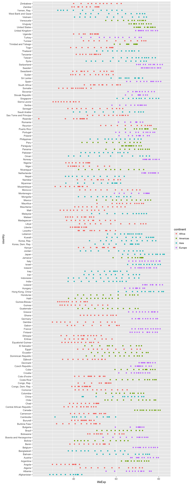

Homework 05
================

Load packages:
==============

``` r
library(tidyverse)
```

    ## Loading tidyverse: ggplot2
    ## Loading tidyverse: tibble
    ## Loading tidyverse: tidyr
    ## Loading tidyverse: readr
    ## Loading tidyverse: purrr
    ## Loading tidyverse: dplyr

    ## Conflicts with tidy packages ----------------------------------------------

    ## filter(): dplyr, stats
    ## lag():    dplyr, stats

``` r
library(forcats)
library(gapminder)
```

Factor management:
==================

Drop Oceania.
-------------

``` r
## Explore gapminder factor continent
str(gapminder)
```

    ## Classes 'tbl_df', 'tbl' and 'data.frame':    1704 obs. of  6 variables:
    ##  $ country  : Factor w/ 142 levels "Afghanistan",..: 1 1 1 1 1 1 1 1 1 1 ...
    ##  $ continent: Factor w/ 5 levels "Africa","Americas",..: 3 3 3 3 3 3 3 3 3 3 ...
    ##  $ year     : int  1952 1957 1962 1967 1972 1977 1982 1987 1992 1997 ...
    ##  $ lifeExp  : num  28.8 30.3 32 34 36.1 ...
    ##  $ pop      : int  8425333 9240934 10267083 11537966 13079460 14880372 12881816 13867957 16317921 22227415 ...
    ##  $ gdpPercap: num  779 821 853 836 740 ...

``` r
str(gapminder$continent)
```

    ##  Factor w/ 5 levels "Africa","Americas",..: 3 3 3 3 3 3 3 3 3 3 ...

``` r
levels(gapminder$continent)
```

    ## [1] "Africa"   "Americas" "Asia"     "Europe"   "Oceania"

``` r
nlevels(gapminder$continent)
```

    ## [1] 5

``` r
fct_count(gapminder$continent)
```

    ## # A tibble: 5 × 2
    ##          f     n
    ##     <fctr> <int>
    ## 1   Africa   624
    ## 2 Americas   300
    ## 3     Asia   396
    ## 4   Europe   360
    ## 5  Oceania    24

``` r
## Drop Oceania using 2 methods:
## method 1:
my_levels <- c("Africa", "Americas", "Asia", "Europe")
gapminder %>% 
  filter(continent %in% my_levels)
```

    ## # A tibble: 1,680 × 6
    ##        country continent  year lifeExp      pop gdpPercap
    ##         <fctr>    <fctr> <int>   <dbl>    <int>     <dbl>
    ## 1  Afghanistan      Asia  1952  28.801  8425333  779.4453
    ## 2  Afghanistan      Asia  1957  30.332  9240934  820.8530
    ## 3  Afghanistan      Asia  1962  31.997 10267083  853.1007
    ## 4  Afghanistan      Asia  1967  34.020 11537966  836.1971
    ## 5  Afghanistan      Asia  1972  36.088 13079460  739.9811
    ## 6  Afghanistan      Asia  1977  38.438 14880372  786.1134
    ## 7  Afghanistan      Asia  1982  39.854 12881816  978.0114
    ## 8  Afghanistan      Asia  1987  40.822 13867957  852.3959
    ## 9  Afghanistan      Asia  1992  41.674 16317921  649.3414
    ## 10 Afghanistan      Asia  1997  41.763 22227415  635.3414
    ## # ... with 1,670 more rows

``` r
## method 2:
my_gap_drop_oceania <- gapminder %>% 
  filter(continent != "Oceania")

## number of rows in gapminder
nrow(gapminder)
```

    ## [1] 1704

``` r
## number of rows now that oceania is gone
nrow(my_gap_drop_oceania)
```

    ## [1] 1680

``` r
## remove unused factor levels:
nlevels(my_gap_drop_oceania$continent) # still have 5 levels
```

    ## [1] 5

``` r
my_gap_drop_oceania$continent %>% 
  fct_drop() %>% 
  levels() # removes levels from stand-alone factor
```

    ## [1] "Africa"   "Americas" "Asia"     "Europe"

``` r
drop_oceania <- my_gap_drop_oceania %>% 
  droplevels()
nlevels(drop_oceania$continent) # now there are 4 levels
```

    ## [1] 4

Reorder the levels of country or continent.
-------------------------------------------

### Change order of country based on mean life expectancy:

``` r
## level order for country before changing the factor level based on mean life expectancy:
drop_oceania$country %>% 
  levels() %>% 
  head()
```

    ## [1] "Afghanistan" "Albania"     "Algeria"     "Angola"      "Argentina"  
    ## [6] "Austria"

``` r
## ...and now after re-ordering:
fct_reorder(drop_oceania$country, drop_oceania$lifeExp, mean) %>% 
  levels() %>% 
  head()
```

    ## [1] "Sierra Leone"  "Afghanistan"   "Angola"        "Guinea-Bissau"
    ## [5] "Mozambique"    "Somalia"

``` r
## note: fct_reorder doesn't actually change anything in the data frame...that's what arrange() does
write_csv(drop_oceania, "drop_oceania.csv")
drop_oceania <- read_csv("drop_oceania.csv")
```

    ## Parsed with column specification:
    ## cols(
    ##   country = col_character(),
    ##   continent = col_character(),
    ##   year = col_integer(),
    ##   lifeExp = col_double(),
    ##   pop = col_integer(),
    ##   gdpPercap = col_double()
    ## )

``` r
## test using arrange() vs. fct_reorder()
arr_drop_oceania <- drop_oceania %>% 
  arrange(lifeExp)

arr_drop_oceania1 <- drop_oceania %>% 
  group_by(country, continent) %>% 
  summarise(mean_life_exp = mean(lifeExp)) %>% 
  arrange(mean_life_exp)
```

Apologies in advance for how long these graphs are. I don't think it's the best way to look at these data, but maybe it's the best way to look at arrange() vs. forcats?
------------------------------------------------------------------------------------------------------------------------------------------------------------------------

``` r
## Solely using arrange() creates a messy plot that does not mirror the order of "country" by "mean_life_exp" the new tibble created
p1 <- ggplot(arr_drop_oceania1, aes(x = mean_life_exp, y = country)) +
  geom_point(aes(color = continent))
p1
```


``` r
## Have to use reorder() to actually plot in the same order as arr_drop_oceania1, which was created using arrange().
## I don't know why yet.
p2 <- ggplot(arr_drop_oceania1, aes(x = mean_life_exp,
                      y = reorder(country, mean_life_exp)))
p2 + geom_point(aes(color = continent))
```


``` r
## Using arrange() without grouping and summarizing first.
p3 <- ggplot(arr_drop_oceania, aes(x = lifeExp, y = country))
p3 + geom_point(aes(color = continent))
```



``` r
## Using reorder() in conjunction with arrange() creates the same graph we can make more simply using forcats. See next graph.
p4 <- ggplot(arr_drop_oceania, aes(x = lifeExp, y = reorder(country, lifeExp)))
p4 + geom_point(aes(color = continent))
```


``` r
## I wanted to play with factor levels more here --- will come back to if I have time.
# arr_drop_oceania2 <- my_gap_drop_oceania %>% 
#   arrange(lifeExp)
# p6 <- ggplot(my_gap_drop_oceania, aes(x = lifeExp, y = reorder(country, lifeExp)))
# p6 + geom_point(aes(color = continent))
```

### Using forcats

``` r
p5 <- ggplot(drop_oceania, aes(x = lifeExp, 
                               y = fct_reorder(drop_oceania$country, drop_oceania$lifeExp, mean)))
p5 + geom_point(aes(color = continent))
```


Experimenting further with File I/O
===================================

``` r
my_gap <- gapminder
gap_pop <- my_gap %>% 
  group_by(country, continent) %>%
  summarize(pop = max(pop)) %>% 
  ungroup()

gap_pop <- gap_pop %>% 
  mutate(country = fct_reorder(country, pop))
levels(gap_pop$country) %>% 
  head()
```

    ## [1] "Sao Tome and Principe" "Iceland"               "Djibouti"             
    ## [4] "Equatorial Guinea"     "Bahrain"               "Comoros"

``` r
## I want to save the manipulations to factor level order that I made, so am saving the R object as 
## opposed to writing it as a csv or txt file
saveRDS(gap_pop, "gap_pop.rds")
rm(gap_pop) # remove the object before trying to read it back in

gap_pop <- readRDS("gap_pop.rds")
levels(gap_pop$country) %>% 
  head()
```

    ## [1] "Sao Tome and Principe" "Iceland"               "Djibouti"             
    ## [4] "Equatorial Guinea"     "Bahrain"               "Comoros"

``` r
## you can see here that the factor order survives re-entry to R

## Proof of concept graph to show myself that changes by fct_reorder() translate to the figure.
## I'm leaving it squished, so that the markdown file isn't ridiculously long.
ggplot(gap_pop, aes(x = pop, y = country)) + geom_point(aes(color = continent)) + scale_x_log10()
```


``` r
## More playing with factors and figures
my_gap <- gapminder
gap_pop <- my_gap %>% 
  group_by(country, continent, lifeExp, year) %>%
  summarize(pop = max(pop)) %>% 
  ungroup()

gap_pop <- gap_pop %>% 
  mutate(country = fct_reorder(country, pop))
levels(gap_pop$country) %>% 
  head()
```

    ## [1] "Sao Tome and Principe" "Iceland"               "Djibouti"             
    ## [4] "Equatorial Guinea"     "Comoros"               "Bahrain"

``` r
ggplot(gap_pop, aes(x = pop, y = country)) + geom_point(aes(color = year, size = lifeExp, alpha = 1/10)) + scale_x_log10()
```


Visualization design
====================

``` r
## here is a plot I made in homework 2 looking at the relationship between life expectancy and GDP per capita
ggplot(gapminder, aes(x = gdpPercap, y = lifeExp)) +
  scale_x_log10() +
  geom_point(aes(color = continent, alpha = 1/3)) +
  geom_smooth()
```


``` r
## let's find a better way to show these data
## Multiply pop by -1 to order from largest to smallest. Removed Oceania because not enough data points
new_gdp_data <- gapminder %>% 
  filter(continent != "Oceania") %>% 
  droplevels() %>% 
  mutate(country = reorder(country, -1*pop, median)) %>% 
  arrange(year, country)  

test_year <- 2007

new_gdp_plot <- new_gdp_data %>% 
  filter(year == test_year)

p7 <- ggplot(new_gdp_plot, aes(x = gdpPercap, y = lifeExp)) + 
  scale_x_log10(limits = c(200, 75000))

# p7 + geom_point(aes(size = pop), pch = 23)

s <- p7 + geom_point(aes(size = pop), pch = 21, show.legend = FALSE) + scale_size_continuous(range = c(1,45))

s <- s + facet_wrap(~continent) + ylim(c(38,100)) + aes(alpha = 1/3, fill = country) +
  scale_fill_manual(values = country_colors)
s
```


``` r
## size of the circle is relative to population size
```

Use ggsave()
============

``` r
ggsave("new_gdp_plot.png", s)
```

    ## Saving 7 x 5 in image

Progress report
===============

I struggled to remember what was going on behind the scenes with the factor reordering (i.e. what was actually changed and what wasn't, etc...). I think I have a tenuous hold on it right now.

I am still not totally clear on when to use dput() and dget().

I think manipulating data visualization using ggplot seems pretty straightforward, but I wish I had more time to really explore it. I am sure that I have barely scratched the surface.
